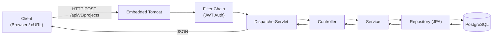
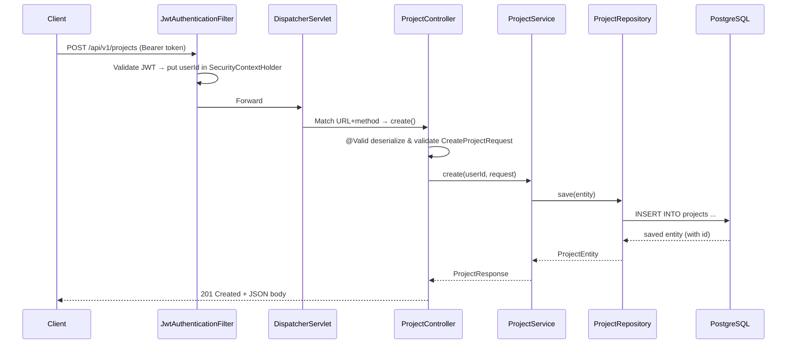
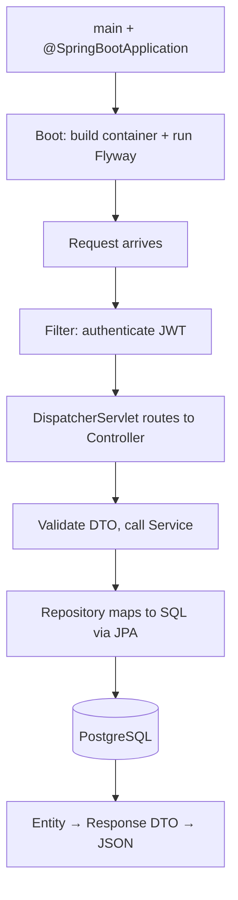
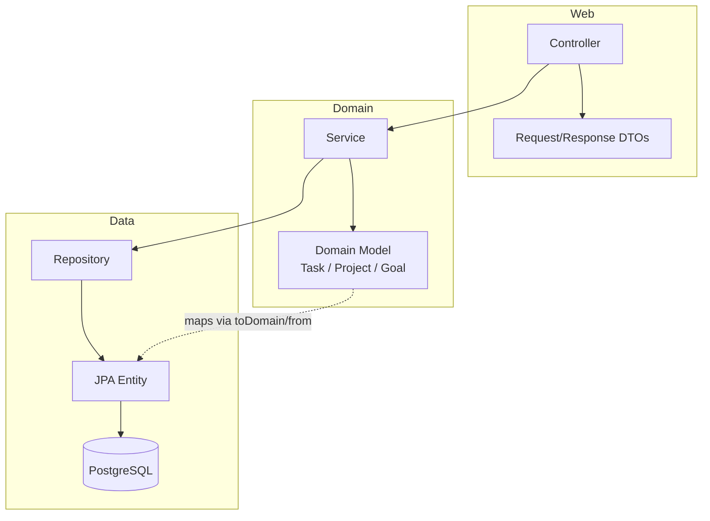
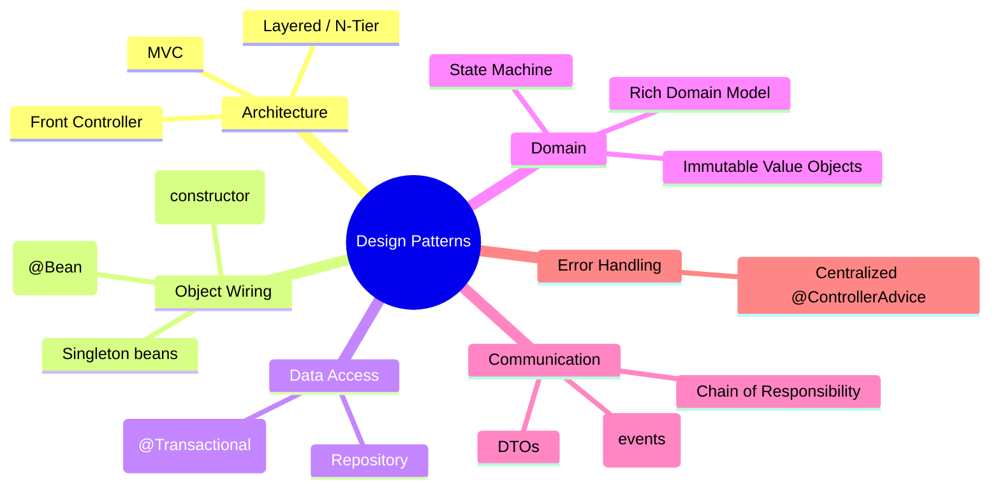

# Spring Boot Request Lifecycle — A Visual Walkthrough

> A beginner-friendly guide to how this API works, traced through **one simple request**:
> `POST /api/v1/projects` (create a project).

---

## Table of Contents

1. [The Big Picture](#1-the-big-picture)
2. [Step 0 — App Boot](#2-step-0--app-boot)
3. [The Request Journey](#3-the-request-journey)
4. [Layer-by-Layer Breakdown](#4-layer-by-layer-breakdown)
5. [The Annotation Cheat Sheet](#5-the-annotation-cheat-sheet)
6. [Configuration & Database](#6-configuration--database)
7. [Key Concepts in One Table](#7-key-concepts-in-one-table)
8. [Design Patterns Used](#8-design-patterns-used)

---

## 1. The Big Picture

A Spring Boot app is a **container of beans**. You never write `new ProjectController(...)`.
Instead, you annotate classes to tell Spring _what they are_, declare dependencies as
constructor parameters, and Spring wires everything together at startup.



```
 Tomcat → Filter → DispatcherServlet → Controller → Service → Repository → Entity → DB
                                              ↓
                                          Response DTO → Jackson → JSON → Client
```

---

## 2. Step 0 — App Boot

`ProductivityOsApplication.kt:9` is the entry point:

```kotlin
fun main(args: Array<String>) {
    runApplication<ProductivityOsApplication>(*args)
}
```

`@SpringBootApplication` (line 6) is a **meta-annotation** that turns on three things:

| What it enables            | What it does                                                                              |
| -------------------------- | ----------------------------------------------------------------------------------------- |
| `@SpringBootConfiguration` | Marks this class as a configuration source                                                |
| `@EnableAutoConfiguration` | Scans your classpath and auto-configures Tomcat, Jackson, JPA, Security                   |
| `@ComponentScan`           | Scans`com.productivityos.*` and registers `@Controller`/`@Service`/`@Repository` as beans |

At startup Spring also:

1. Reads `application.yml` for settings (port, DB URL, secrets).
2. Runs **Flyway** migrations (the `V1__…` … `V11__…` SQL files) against Postgres.
3. Builds the **ApplicationContext** — a map of singletons wired by constructor injection.

---

## 3. The Request Journey



---

## 4. Layer-by-Layer Breakdown

### 4.1 Controller — `ProjectController.kt`

```kotlin
@RestController
@RequestMapping("/api/v1/projects")
class ProjectController(
    private val projectService: ProjectService,   // injected
    private val currentUser: CurrentUser          // injected
) {
    @PostMapping
    fun create(@Valid @RequestBody request: CreateProjectRequest): ResponseEntity<ProjectResponse> {
        val project = projectService.create(currentUser.id(), request)
        val location = URI.create("/api/v1/projects/${project.id}")
        return ResponseEntity.created(location).body(project)
    }
}
```

| Annotation        | Meaning                                              |
| ----------------- | ---------------------------------------------------- |
| `@RestController` | `@Controller` + auto-serialize return values to JSON |
| `@RequestMapping` | Class-level URL prefix                               |
| `@PostMapping`    | Maps`POST /api/v1/projects` to this method           |
| `@RequestBody`    | Deserialize JSON body into a Kotlin`data class`      |
| `@Valid`          | Trigger bean validation on the request object        |

### 4.2 Request DTO + Validation — `CreateProjectRequest.kt`

```kotlin
data class CreateProjectRequest(
    @field:NotBlank
    @field:Size(max = 500)
    val title: String,
    val description: String? = null,
    val goalId: UUID? = null,
    val deadline: LocalDate? = null
)
```

If validation fails, Spring throws `MethodArgumentNotValidException`, caught by
`GlobalExceptionHandler` → returned as a clean JSON error.

### 4.3 Service — `ProjectService.kt`

```kotlin
@Service
@Transactional
class ProjectService(
    private val projectRepository: ProjectRepository,
    private val clock: Clock
) {
    fun create(userId: UUID, request: CreateProjectRequest): ProjectResponse {
        val now = clock.instant()
        val entity = ProjectEntity.from(userId, request.title, /* ... */, now)
        return ProjectResponse.from(projectRepository.save(entity))
    }
}
```

- `@Service` → a Spring bean holding business logic.
- `@Transactional` → wraps the method in a DB transaction (commit on success, rollback on error).

### 4.4 Repository — `ProjectRepository.kt` (no implementation!)

```kotlin
interface ProjectRepository : JpaRepository<ProjectEntity, UUID> {
    @Query("SELECT p FROM ProjectEntity p WHERE p.userId = :userId ORDER BY p.createdAt DESC")
    fun findAllByUserId(userId: UUID): List<ProjectEntity>
}
```

Spring Data JPA **generates the implementation at runtime**. `save`, `findById`, `delete`
come free; custom `@Query` methods are derived from the method name or JPQL.

### 4.5 Entity — `ProjectEntity.kt` (maps to a DB table)

```kotlin
@Entity
@Table(name = "projects")
class ProjectEntity(
    @Id @GeneratedValue(strategy = GenerationType.UUID)
    val id: UUID? = null,
    @Column(name = "user_id", nullable = false) val userId: UUID,
    @Column(nullable = false) var title: String,
    @Enumerated(EnumType.STRING) @Column(nullable = false) var status: ProjectStatus,
    @Version var version: Long = 0
)
```

| Annotation              | Meaning                                       |
| ----------------------- | --------------------------------------------- |
| `@Entity`               | This class maps to a database table           |
| `@Table`                | Explicit table name (`projects`)              |
| `@Id`                   | Primary key                                   |
| `@GeneratedValue(UUID)` | DB/UUID-generated id                          |
| `@Column`               | Maps field → column (name, nullability, etc.) |
| `@Enumerated(STRING)`   | Store enum as text, not ordinal               |
| `@Version`              | Optimistic-locking version column             |

`save()` = `INSERT` when `id == null`, `UPDATE` otherwise.

### 4.6 Response DTO — `ProjectResponse.kt`

A plain `data class` that shields the client from the entity. `Jackson` (with
`jackson-module-kotlin`) serializes it to JSON automatically.

---

## 5. The Annotation Cheat Sheet

| Annotation                      | Stereo-type  | Job                                       |
| ------------------------------- | ------------ | ----------------------------------------- |
| `@SpringBootApplication`        | app          | Enable auto-config + component scan       |
| `@RestController`               | controller   | Handle HTTP, return JSON                  |
| `@Service`                      | service      | Business logic bean                       |
| `@Repository` / `JpaRepository` | data         | Database access                           |
| `@Component`                    | generic      | Any bean (e.g.`CurrentUser`)              |
| `@Configuration`                | config       | Define/override beans (e.g.`ClockConfig`) |
| `@Transactional`                | method/class | Wrap in a DB transaction                  |
| `@Entity`                       | data         | Maps class → table                        |

---

## 6. Configuration & Database

Everything is driven from `application.yml`:

```yaml
spring:
  datasource:
    url: ${DB_URL:jdbc:postgresql://localhost:5432/productivity_os}
  jpa:
    hibernate:
      ddl-auto: validate # schema is owned by Flyway, Hibernate only checks it
  flyway:
    enabled: true
    locations: classpath:db/migration
server:
  port: ${SERVER_PORT:8080}
```

Key ideas:

- `${DB_URL:default}` → environment-variable override with a fallback.
- **Flyway owns the schema** (the `V1__…` … `V11__…` files in `src/main/resources/db/migration`).
  Hibernate is set to `validate` only — it never creates or alters tables.

---

## 7. Key Concepts in One Table

| Concept                        | One-line explanation                                           |
| ------------------------------ | -------------------------------------------------------------- |
| **Inversion of Control (IoC)** | Spring creates & wires your objects; you declare what you need |
| **Dependency Injection**       | Pass dependencies via constructor params, never`new`           |
| **Bean**                       | A singleton object managed by the Spring container             |
| **ApplicationContext**         | The container holding all beans                                |
| **Auto-configuration**         | Spring sets up infra (Tomcat/Jackson/JPA) from your classpath  |
| **DispatcherServlet**          | Front controller that routes HTTP requests to controllers      |
| **Filter**                     | Pre/post-processing around requests (auth, tracing)            |
| **Spring Data JPA**            | Auto-implements repositories from interfaces                   |
| **Flyway**                     | Versioned, ordered SQL migrations (source of truth for schema) |

---

## TL;DR



**One rule to remember:** annotate what a class _is_, ask for what it _needs_ in the
constructor, and Spring does the rest.

---

## 8. Design Patterns Used

This project follows a clean, layered architecture with a rich domain model. The patterns
below are grouped by what they solve, each with a real location in the codebase.

### 8.1 Architectural Patterns



| Pattern                     | What it is                                                                | Where                                                        |
| --------------------------- | ------------------------------------------------------------------------- | ------------------------------------------------------------ |
| **Layered / N-Tier**        | Strict top-down flow: Controller → Service → Repository                    | every `*Controller` → `*Service` → `*Repository`             |
| **Model-View-Controller**   | View-less MVC (returns JSON, no JSP)                                      | all `@RestController` classes                                |
| **Front Controller**        | Single entry point that routes every request                              | Spring's `DispatcherServlet` (auto-configured)               |

### 8.2 Inversion of Control & Dependency Injection

The foundation of the whole app. Beans are declared via annotations and wired by
**constructor injection** — you never `new` a dependency.

```kotlin
@Service
class ProjectService(
    private val projectRepository: ProjectRepository,   // injected
    private val clock: Clock                            // injected (see ClockConfig)
)
```

| Pattern                        | Where                                                          |
| ------------------------------ | -------------------------------------------------------------- |
| **Dependency Injection** (ctor) | every service/controller constructor                           |
| **Singleton**                  | Spring beans are singletons by default (e.g. `ClockConfig.clock()`) |
| **Configuration + `@Bean`**    | `ClockConfig.kt:10` exposes `Clock` as a bean                  |

### 8.3 Repository Pattern

`ProjectRepository.kt` is a plain `interface`; Spring Data JPA generates the SQL-backed
implementation at runtime. Callers only see `save` / `findById` / `findAllByUserId` —
no SQL leaks into the service layer.

### 8.4 DTO Pattern (Data Transfer Objects)

The API never exposes JPA entities. Request and response shapes are separate `data class`es:

| Kind              | Examples                                              |
| ----------------- | ----------------------------------------------------- |
| **Request DTO**   | `CreateProjectRequest`, `LoginRequest`, `RegisterRequest` |
| **Response DTO**  | `ProjectResponse`, `TaskResponse`, `UserResponse`      |
| **Error DTO**     | `ErrorResponse` (code + message + traceId)             |

### 8.5 Rich Domain Model + State Machine

Business rules live in **immutable** domain classes, separate from persistence. Each
transition is guarded so invalid state changes are impossible.

```kotlin
// Task.kt — the "State" pattern: valid transitions are encoded as methods
fun plan(): Task {
    requireTransition(TaskStatus.INBOX, TaskStatus.PLANNED)   // throws if wrong state
    return copy(status = TaskStatus.PLANNED)                   // immutable copy
}
```

```
Task:     INBOX → PLANNED → IN_PROGRESS → COMPLETED
             ↘ CANCELLED (from INBOX/PLANNED/IN_PROGRESS)

Project:  DRAFT → ACTIVE → COMPLETED → ARCHIVED

Goal:     DRAFT → ACTIVE → COMPLETED → ARCHIVED
```

| Pattern                           | Where                                                              |
| --------------------------------- | ------------------------------------------------------------------ |
| **State / State Machine**         | `Task.kt`, `Project.kt`, `Goal.kt` transition methods              |
| **Entity vs Domain separation**   | `ProjectEntity` (JPA) ↔ `Project` (domain) via `toDomain()` / `from()` |
| **Immutable Value Object**        | Kotlin `data class` with `copy()` (returns a new object)           |

### 8.6 Observer (Event-Driven)

`TaskService` **publishes** domain events; unrelated services **subscribe** without being
called directly. This keeps `TaskService` decoupled from Top-Three bookkeeping.

```kotlin
// Publisher — TaskService.kt:67
eventPublisher.publishEvent(TaskCompletedEvent(taskId, userId))

// Subscriber — TopThreeSyncService.kt:17
@EventListener
fun onTaskDeleted(event: TaskDeletedEvent) { /* ... */ }
```

Events: `TaskCompletedEvent`, `TaskCancelledEvent`, `TaskDeletedEvent`, `TaskRestoredEvent`
(`TaskEvents.kt`).

### 8.7 Chain of Responsibility + Template Method

Requests pass through an ordered chain of filters, each of which can act and/or pass on:

```
TraceIdFilter → JwtAuthenticationFilter → DispatcherServlet → Controller
```

| Pattern                     | Where                                                                  |
| --------------------------- | ---------------------------------------------------------------------- |
| **Chain of Responsibility** | the `SecurityFilterChain` (`SecurityConfig.kt:24`)                     |
| **Template Method**         | `TraceIdFilter` / `JwtAuthenticationFilter` extend `OncePerRequestFilter` and override `doFilterInternal` |
| **Interceptor**             | filters run before/after every request (trace id, auth)                |

### 8.8 Centralized Exception Handling

`GlobalExceptionHandler` (`@ControllerAdvice`) is a single place that maps exceptions →
HTTP status + `ErrorResponse`. Controllers/services just `throw`; they never build error
bodies.

```kotlin
@ExceptionHandler(ProjectNotFoundException::class)
fun handleProjectNotFound(ex: ProjectNotFoundException): ResponseEntity<ErrorResponse> { ... }
```

### 8.9 Creational Patterns

| Pattern                         | Where                                                                 |
| ------------------------------- | --------------------------------------------------------------------- |
| **Static Factory Method**       | companion `from()` on `ProjectEntity`, `ProjectResponse`, `TaskResponse`; `EligibilityResult.eligible()` / `ineligible()` |
| **Builder**                     | `Jwts.builder()...` in `TokenService.kt` (JJWT library)               |
| **Result / Either-lite**        | `EligibilityResult(eligible, reason)` avoids exceptions for a check   |

### 8.10 Transactional Unit of Work

`@Transactional` on services wraps a multi-step operation in one DB transaction — all or
nothing (commit on success, rollback on error). Read-only methods use
`@Transactional(readOnly = true)`.

```kotlin
@Service
@Transactional
class ProjectService { ... }
```

---

## Pattern Summary (Quick Reference)


