# Productivity OS — iOS Architecture

> Visual overview of the iOS app at `apps/ios/`. The goal is a single diagram
> that captures how data flows in **one direction** through the app, end to end.

---

## 1. Layered Architecture

The app follows a strict **one-way data flow**:

```
Sources  →  Transport  →  Domain Services  →  ViewModels  →  Views
   ▲                                                       │
   │                                                       │
   └────────────── SwiftUI re-renders (state only) ────────┘
```

State never mutates backwards. Views emit **intents** (button taps, focus
transitions). ViewModels interpret intents, call services, and update their
`@Observable` properties. SwiftUI re-renders the affected views. The transport
layer (APIClient) is the only place that talks to the backend.

```
┌─────────────────────────────────────────────────────────────────────┐
│                              VIEWS                                  │
│   SwiftUI screens (Today, Focus, Tasks, Profile, Login, …).         │
│   Pure render of ViewModel state. Emit user intents upward via       │
│   closures (onStartFocus, onSelectTask, submit, …).                 │
└──────────────────────────────▲──────────────────────────────────────┘
                               │ closures (intents)
                               │ state (read-only)
┌──────────────────────────────┴──────────────────────────────────────┐
│                          VIEW MODELS                                │
│   @Observable types (TodayViewModel, FocusSessionViewModel,         │
│   ProjectsViewModel). Own UI-facing state and user-message mapping. │
│   Coordinate concurrent service calls (async let). No UIKit, no     │
│   networking code here.                                             │
└──────────────────────────────▲──────────────────────────────────────┘
                               │ async calls (throwing)
                               │ decoded domain models
┌──────────────────────────────┴──────────────────────────────────────┐
│                       DOMAIN SERVICES                               │
│   Thin wrappers around APIClient: AuthService, TaskService,         │
│   ProjectService, FocusService, TopThreeService,                    │
│   QRAuthenticationService. Translate endpoints into typed calls.    │
└──────────────────────────────▲──────────────────────────────────────┘
                               │ APIRequesting (protocol)
                               │ Decodable models
┌──────────────────────────────┴──────────────────────────────────────┐
│                         TRANSPORT                                   │
│   APIClient (URLSession + async/await).                             │
│   - Bearer header injection from AuthSession                        │
│   - Single-flight 401 → POST /auth/refresh → retry once             │
│   - NetworkLogger + APILogStore (debug surface)                     │
│   - APIError mapping (ADR-005 structured errors)                   │
└──────────────────────────────▲──────────────────────────────────────┘
                               │ HTTPS (JSON)
┌──────────────────────────────┴──────────────────────────────────────┐
│                     SOURCES (Backend / Device)                      │
│   • Productivity OS backend (Spring Boot on Cloud Run)               │
│   • Keychain (access token + cached profile)                        │
│   • URLSession cookie storage (HttpOnly refresh-token cookie)       │
└─────────────────────────────────────────────────────────────────────┘
```

---

## 2. One-Way Data Flow (Mermaid)

```mermaid
flowchart TD
    %% =========== SOURCES ===========
    subgraph SRC["Sources"]
        Backend["Productivity OS Backend\n(Spring Boot · Cloud Run)"]
        Keychain["iOS Keychain\n(access token + cached user)"]
        CookieJar["URLSession Cookie Storage\n(HttpOnly refresh cookie)"]
    end

    %% =========== TRANSPORT ===========
    subgraph TR["Transport Layer"]
        APIClient["APIClient\nURLSession + async/await"]
        Endpoint["AppEndpoint (type-safe paths)"]
        APIClient --> Endpoint
    end

    %% =========== DOMAIN SERVICES ===========
    subgraph SVC["Domain Services"]
        AuthSvc["AuthService"]
        TaskSvc["TaskService"]
        ProjSvc["ProjectService"]
        FocusSvc["FocusService"]
        Top3Svc["TopThreeService"]
        QRSvc["QRAuthenticationService"]
    end

    %% =========== VIEW MODELS ===========
    subgraph VM["View Models (@Observable)"]
        AuthSession["AuthSession\n(isAuthenticated gate)"]
        TodayVM["TodayViewModel"]
        FocusVM["FocusSessionViewModel\n(local timer ↔ server sync)"]
        ProjectsVM["ProjectsViewModel"]
    end

    %% =========== VIEWS ===========
    subgraph VW["SwiftUI Views"]
        App["ProductivityOSApp\n(root switcher)"]
        Login["LoginView\n+ QRScannerView"]
        MainTab["MainTabView\n(TabView · 4 tabs)"]
        Today["TodayView\n(Top 3 + Focus Today)"]
        FocusPrep["FocusPreparationView"]
        ActiveFocus["ActiveFocusView\n(running/paused)"]
        FocusDone["FocusCompletionView"]
        Tasks["TasksView"]
        Profile["ProfileView"]
    end

    %% ---------- Source → Transport ----------
    Backend -- "JSON /api/v1/*" --> APIClient
    Keychain -- "accessToken" --> AuthSession
    CookieJar -- "refresh cookie" --> APIClient

    %% ---------- Transport → Services ----------
    APIClient -- "Decodable models" --> AuthSvc
    APIClient -- "Decodable models" --> TaskSvc
    APIClient -- "Decodable models" --> ProjSvc
    APIClient -- "Decodable models" --> FocusSvc
    APIClient -- "Decodable models" --> Top3Svc
    APIClient -- "Decodable models" --> QRSvc

    %% ---------- Services → ViewModels ----------
    AuthSvc -- "setSession()" --> AuthSession
    QRSvc -- "setSession()" --> AuthSession
    TaskSvc -- "[TaskItem]" --> TodayVM
    Top3Svc -- "[TopThreeItem]" --> TodayVM
    FocusSvc -- "[FocusSession]" --> TodayVM
    FocusSvc -- "FocusSession" --> FocusVM
    ProjSvc -- "[Project]" --> ProjectsVM

    %% ---------- ViewModels → Views ----------
    AuthSession -- "isAuthenticated" --> App
    App -- "if unauthenticated" --> Login
    App -- "if authenticated" --> MainTab
    TodayVM --> Today
    ProjectsVM --> Today
    ProjectsVM --> FocusPrep
    FocusVM --> FocusPrep
    FocusVM --> ActiveFocus
    FocusVM --> FocusDone
    ProjectsVM --> Tasks
    MainTab --> Today
    MainTab --> FocusPrep
    MainTab --> Tasks
    MainTab --> Profile
    MainTab -- "selectedTask" --> FocusPrep
    Today -- "onStartFocus / onSelectTask (intent)" --> MainTab
    Tasks -- "onSelectTask (intent)" --> MainTab

    %% ---------- Intents flow back down (closures only) ----------
    FocusPrep -- "startFocus() intent" --> FocusVM
    ActiveFocus -- "pause/complete/cancel intent" --> FocusVM
    Login -- "authenticate() intent" --> AuthSvc
    Login -- "authenticateQR(challenge)" --> QRSvc

    %% ---------- Auth refresh loop (single-flight) ----------
    APIClient -. "401 → POST /auth/refresh\n(once, single-flight)" .-> APIClient
    APIClient -. "refresh fails → logout()" .-> AuthSession

    %% ---------- Visual style ----------
    classDef src fill:#F2EFFF,stroke:#6C47FF,color:#111026
    classDef tr  fill:#EAE4FF,stroke:#6C47FF,color:#111026
    classDef svc fill:#DFD6FF,stroke:#6C47FF,color:#111026
    classDef vm  fill:#C4B5FD,stroke:#5832E6,color:#111026
    classDef vw  fill:#6C47FF,stroke:#3D2BB5,color:#FFFFFF
    class Backend,Keychain,CookieJar src
    class APIClient,Endpoint tr
    class AuthSvc,TaskSvc,ProjSvc,FocusSvc,Top3Svc,QRSvc svc
    class AuthSession,TodayVM,FocusVM,ProjectsVM vm
    class App,Login,MainTab,Today,FocusPrep,ActiveFocus,FocusDone,Tasks,Profile vw
```



**Reading the diagram top-to-bottom = the one-way flow.**
Reading bottom-to-top = the **intent** path: views emit closures,
view models orchestrate, services translate, transport hits the backend,
the response bubbles back as `Decodable` models, view models mutate their
`@Observable` state, and SwiftUI re-renders only the views that read
the changed state.

---

## 3. Component Map

```
apps/ios/ProductivityOS/
├── App/
│   └── ProductivityOSApp.swift     # @main entry · auth-gated root switcher
├── Core/
│   ├── DesignSystem/                # Tokens + reusable SwiftUI components
│   │   ├── AppColors.swift          # Lavender canvas / navy focus tokens
│   │   ├── AppTypography.swift      # Display, Rounded, Mono scales
│   │   ├── AppSpacing.swift         # 4pt grid + AppRadius
│   │   ├── AppMotion.swift          # Spring/animation presets
│   │   └── Components/              # AppCard, AppButton, TaskRowView,
│   │                                # SectionHeaderView, FocusClockView,
│   │                                # CustomTabBar, APIStateView
│   ├── Networking/                  # Transport layer
│   │   ├── APIConfiguration.swift   # Dev / Staging / Prod baseURL
│   │   ├── Endpoint.swift           # Endpoint protocol + AppEndpoint
│   │   ├── APIClient.swift          # URLSession + 401 single-flight refresh
│   │   ├── APIDTOs.swift            # LoginRequest, StartFocusRequest, …
│   │   ├── APIError.swift           # Structured error (ADR-005)
│   │   ├── NetworkLogger.swift      # OSLog + sensitive-data redaction
│   │   └── APILogStore.swift        # In-memory debug request log
│   ├── Authentication/              # Identity boundary
│   │   ├── KeychainManager.swift    # Generic-password wrapper
│   │   └── AuthSession.swift        # @Observable token + profile holder
│   ├── Services/                    # Domain services (one per backend controller)
│   │   ├── AuthService.swift        # login / register / logout
│   │   ├── QRAuthenticationService.swift  # QR challenge → /auth/qr/exchange
│   │   ├── TaskService.swift        # GET /tasks
│   │   ├── ProjectService.swift     # GET /projects
│   │   ├── TopThreeService.swift    # GET /daily-top-three/{date}
│   │   └── FocusService.swift       # start / active / end / list
│   ├── Extensions/                  # SwiftUI/Swift conveniences
│   └── Utilities/                   # SampleData, Haptics
├── Models/                          # Plain Codable domain types
│   ├── User.swift
│   ├── Project.swift
│   ├── Task.swift                   # TaskItem + Priority/Energy/Status
│   ├── TopThree.swift
│   ├── FocusSession.swift           # Server-side session record
│   ├── FocusSessionState.swift      # Client-side timestamp state machine
│   └── FocusDuration.swift          # 25m / 45m / 60m / Unlimited
├── Features/                        # One folder per screen cluster
│   ├── Authentication/              # LoginView, QRScannerView, QRConfirmationView
│   ├── Main/                        # MainTabView (root tab + focus sheet orchestration)
│   ├── Today/                       # TodayView + TodayViewModel
│   ├── Focus/                       # FocusPreparationView, ActiveFocusView,
│   │                                # FocusCompletionView, FocusSessionViewModel
│   ├── Tasks/                       # TasksView + TasksViewModel
│   ├── Projects/                    # ProjectsViewModel (cache + name resolver)
│   └── Profile/                     # ProfileView
└── Resources/Info.plist
```

---

## 4. Auth Boundary (Special Path)

The login / register / QR flows short-circuit the normal ViewModel layer
because they *are* the source of the `AuthSession` itself. Even so, data
still flows in one direction:

```
LoginView ──intent──▶ AuthService / QRAuthenticationService
                          │
                          ▼
                       APIClient ──HTTPS──▶ /api/v1/auth/{login|register|qr/exchange}
                          │
                          ▼
                       AuthResponse (accessToken + user)
                          │
                          ▼
                       AuthSession.setSession(...)
                          │
                          ▼ (isAuthenticated flips)
                       ProductivityOSApp re-renders → MainTabView
```

**Refresh** is a pure transport-layer concern inside `APIClient`:

```
401 on any non-auth endpoint
        │
        ▼
single-flight Task → POST /api/v1/auth/refresh
        │                (refresh cookie sent automatically by URLSession)
        ├─ 200 + accessToken → setSession → retry original request once
        └─ anything else    → AuthSession.logout() → app root shows LoginView
```

`AuthSession` is also persisted through `KeychainManager` (`kSecAttrAccessibleAfterFirstUnlock`),
so a cold start with a still-valid access token lands directly in `MainTabView`;
an expired one simply triggers the silent refresh on the first API call.

---

## 5. Focus Flow (Local Timer vs Server Sync)

The only feature where client state and server state are deliberately split:

```
   ┌───────────────────────────────┐         ┌──────────────────────────────┐
   │   FocusSessionState (client)  │         │  FocusSession (server DTO)    │
   │   timestamp-based state machine│         │  recorded by /focus endpoints │
   │   source of truth for countdown│         │                              │
   └───────────────┬───────────────┘         └──────────────┬───────────────┘
                   │ start() / pause() / resume() /        │
                   │ complete() / cancel() / reset()       │ start / end / active
                   ▼                                        ▼
            FocusSessionViewModel  ◀── syncStart / syncEnd / confirmCompletion
                   │
                   ▼
            ActiveFocusView · FocusCompletionView
```

Pause and resume have **no backend contract** — they are local-only.
Start (`POST /focus`) and end (`POST /focus/{id}/end`) are the only sync
points; `restoreActiveSession()` rehydrates the timer from
`GET /focus/active` after a relaunch or backgrounding.

---

## 6. Design System Boundary

`Core/DesignSystem/` is intentionally framework-only and **never imports**
`Models/`, `Services/`, or any view model. It exposes:

- **Tokens**: `AppColors`, `AppTypography`, `AppSpacing` (`AppRadius`),
  `AppMotion`.
- **Components**: `AppCard`, `AppButton`, `TaskRowView`, `SectionHeaderView`,
  `FocusClockView`, `CustomTabBar`, `APIStateView` (loading/empty/error).

This keeps views consistent with the approved references
(`docs/design/references/ios-today-approved.png`,
`ios-focus-flow-approved.png`) and avoids drift across features.

---

## 7. Concurrency & Threading

| Layer            | Mechanism                                          |
|------------------|----------------------------------------------------|
| Transport        | `URLSession.data(for:)` async/await, no callbacks  |
| 401 refresh      | `NSLock`-guarded single-flight `Task<Bool, Never>` |
| Services         | `async throws` wrappers, `Sendable` structs        |
| ViewModels       | `@Observable` + `@MainActor`-implicit UI updates   |
| Focus timer      | Local 0.5s `Task` ticker; truth = wall-clock math  |
| Network logger   | `OSLog` + `APILogStore` (MainActor-isolated)       |

---

## 8. Error & Loading Surface

Every API-backed screen renders through `APIStateView` with three cases:

```
.loading(message:) → ProgressView + caption
.empty(icon:title:subtitle:) → icon + copy
.error(message:onRetry:) → warning + Retry (calls viewModel.loadData)
```

Errors are user-friendly strings produced by
`TodayViewModel.userMessage(for:)` / `FocusSessionViewModel.userMessage(for:)`,
which unwrap `APIError.errorDescription` (ADR-005 structured body) or fall
back to a connectivity message. Raw `APIError` values never reach the view.